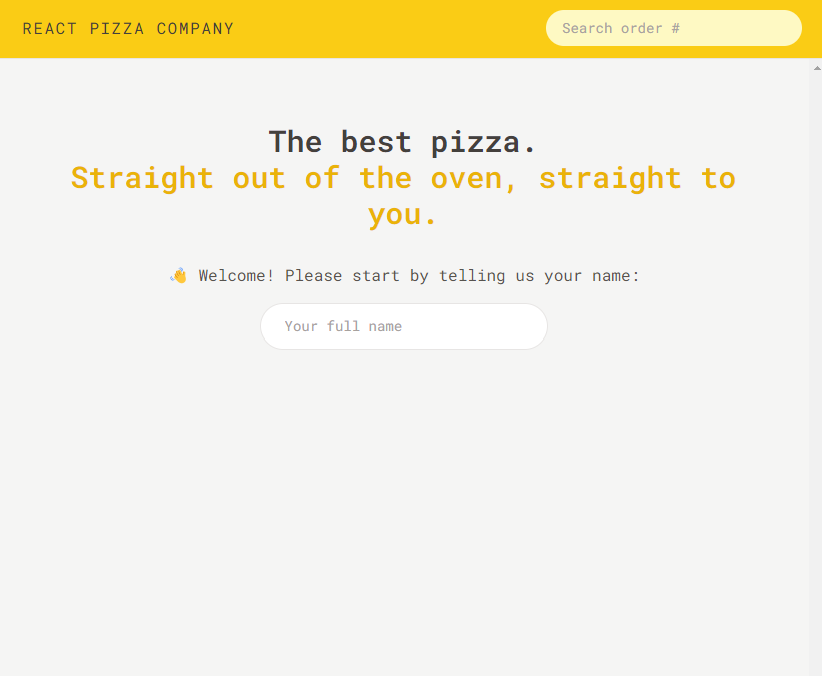
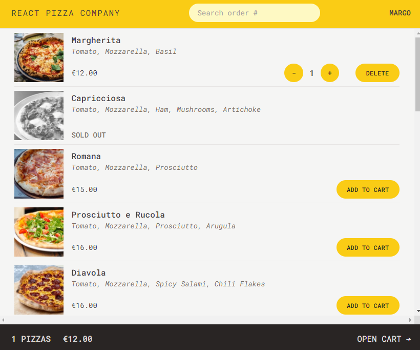
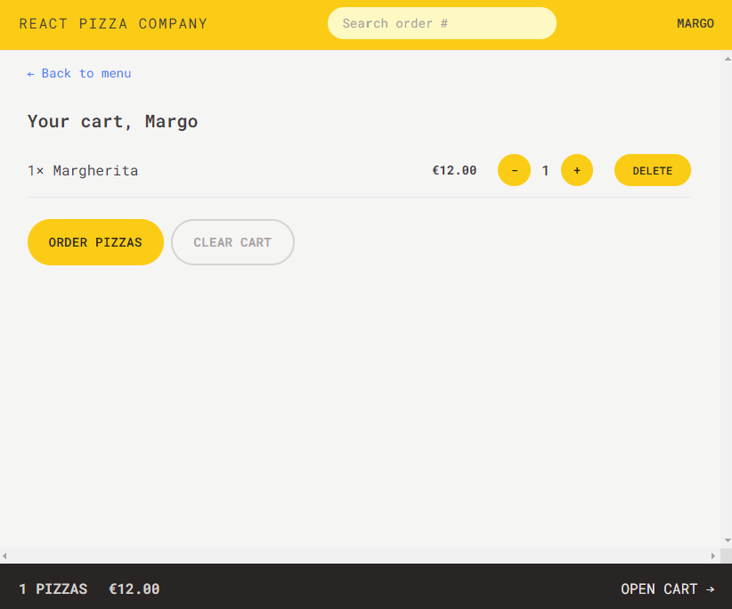
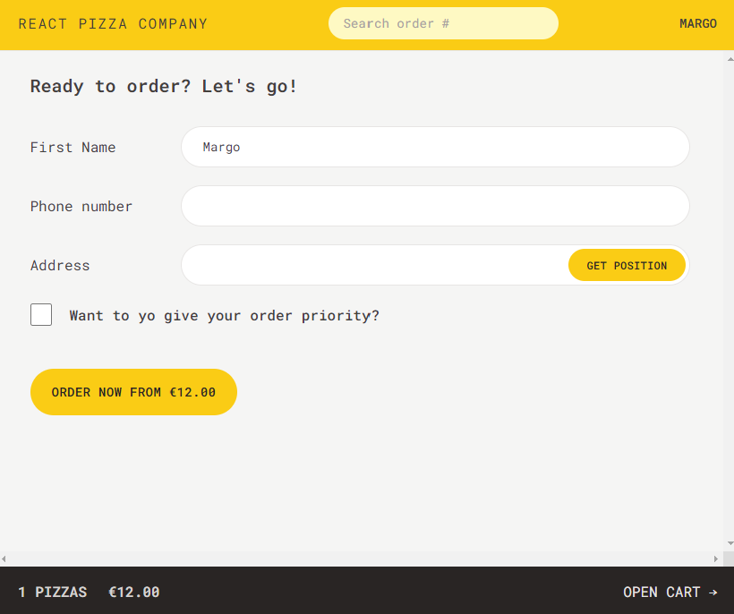
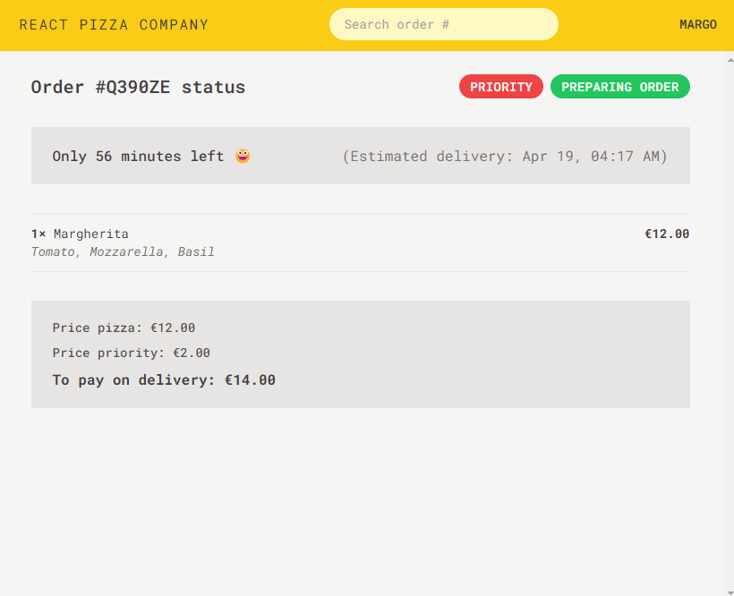
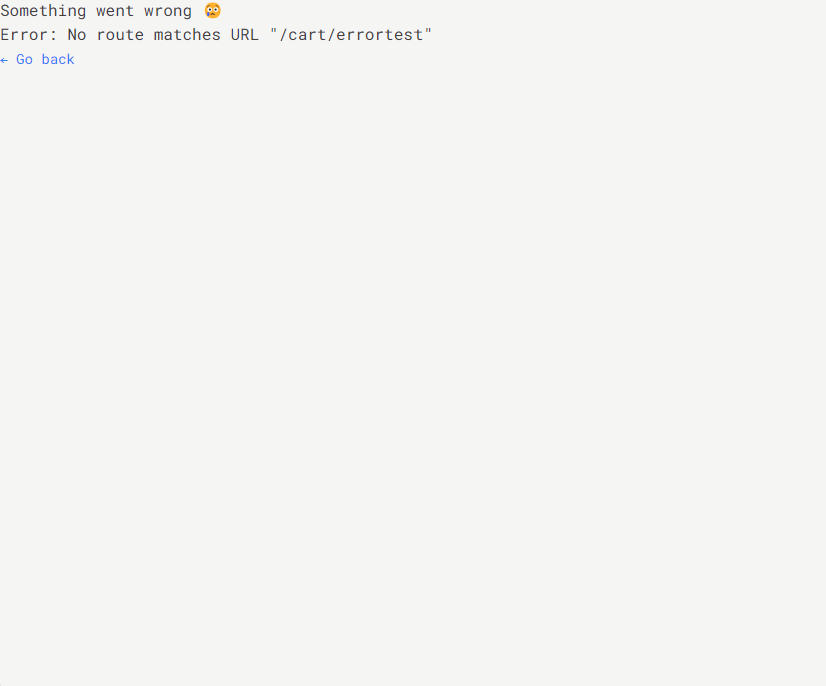

# PIZZA COMPANY

PIZZA COMPANY is a training project that imitates ordering pizza online.  
User can sign up with a name, choose pizza from a menu, review selected items in the cart, place order, review estimated delivery time, update order.

## Technologies used

This is **Vite** and **React** based application written in **JavaScript**.
Built with:

- **React Router** for client cite routing.
- **Redux Toolkit** for state managment.
- **Tailwind CSS** for styling.

## Learning targets

1. Learning React-Router:

- to fetch data before component mounts: loader, useLoader(), loader that uses params of URL.
- to manage POST request: action, Form component, useActionData() to indicate errors of form, useFetcher() to do updates (fetching with useEffect, fetcher.Form) after mounting and loading.
- usage of useNavigation hook to indicate page loading and POST request operation lifecycle.

2. Learning Redux Toolkit:

- creating selectors.
- calling reducer from another reducer.
- usage of createAsyncThunk for async actions before updating the state (getting geolocation of user).
- usage of extraReducers: reducers according to a action type of createAsyncThunk (different stage in the lifecycle of the asynchronous operation that the thunk is performing).
  -managing errors with useRouteError().

3. Usage of Tailwind CSS: creating custom rules.

4. Creating custom UI components.
    
    
   
   
   
   
   
   

## Usage

To clone and run this application, you will need Git and Node.js installed on your computer.
From your command line:

Clone the repository to your local machine:

    $ git clone https://github.com/yana-shick/Pizza-Company.git

Navigate to the project directory:

    $ cd Pizza-Company

Install dependencies:

    $ npm install

Start the development server:

    $ npm run dev

Open your browser and visit http://localhost:5173/ to view the app.

## Credits

Based on _The Ultimate React Course 2024: React, Redux & More_ by Jonas Schmedtmann, Udemy.com.
